# 🛒 Predictor de Valor de Pedidos Amazon

Sistema predictivo que clasifica un pedido de Amazon como **alto valor** o **bajo valor**
económico (respecto a la mediana de `TotalAmount`), con una app web interactiva en Streamlit.

**PA02 — Analítica de Datos | Grupo 05 | USS 2026-I**

---

## La app

El usuario introduce los datos del pedido y el modelo devuelve la clasificación con su
probabilidad. Incluye estadísticas del dataset e historial de la sesión.

<p align="center">
  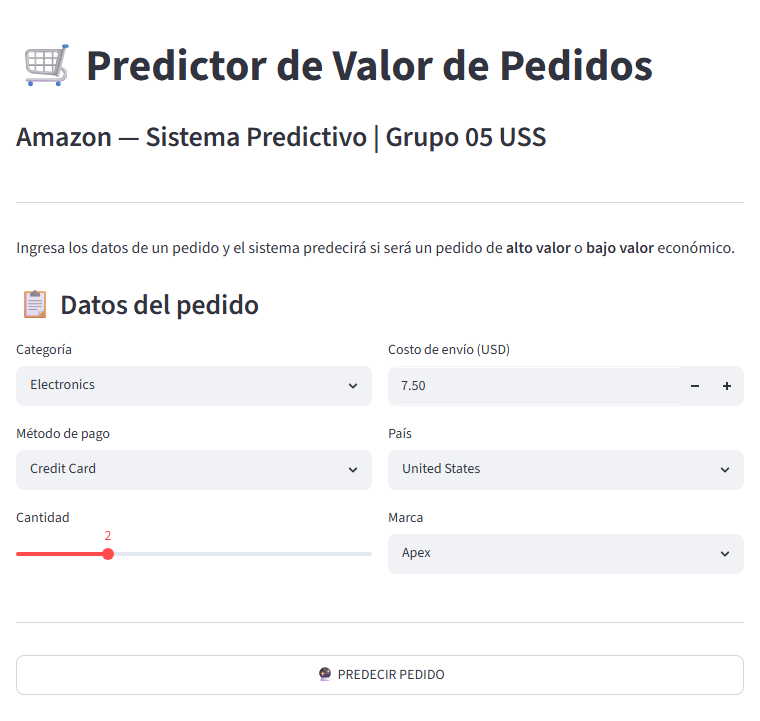
</p>

<table>
<tr>
<td width="50%">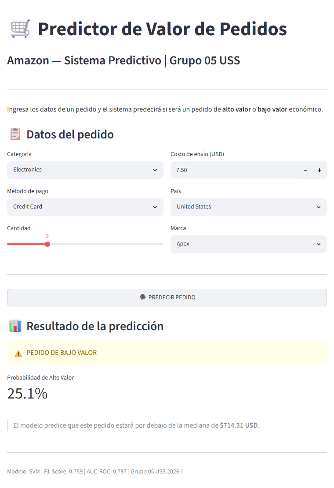</td>
<td width="50%">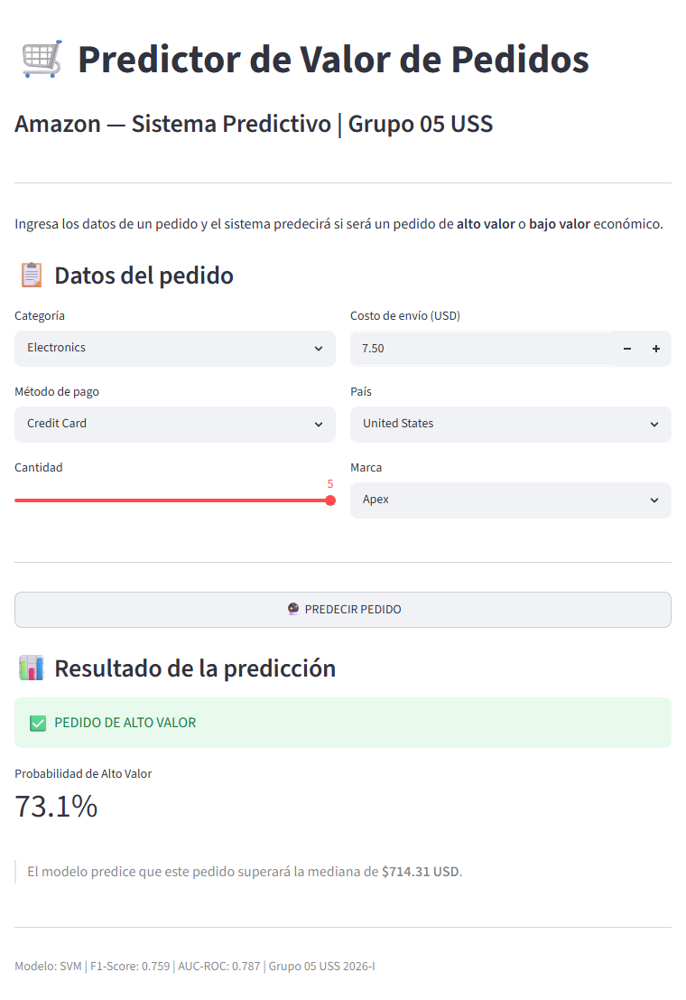</td>
</tr>
<tr>
<td align="center"><sub>Predicción: bajo valor</sub></td>
<td align="center"><sub>Predicción: alto valor</sub></td>
</tr>
</table>

## Modelo

Se compararon varios clasificadores sobre 100 000 pedidos. **Ganó un SVM**:

| Métrica | Valor |
|---|---|
| F1 | **0.759** |
| AUC-ROC | **0.787** |

<table>
<tr>
<td width="50%">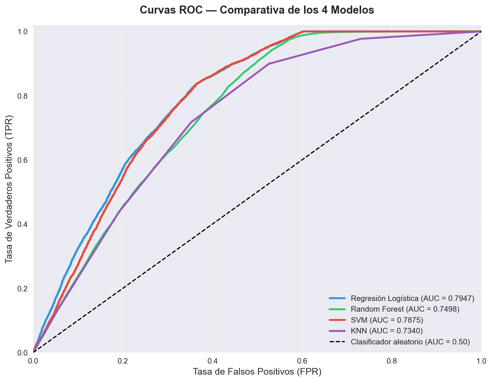</td>
<td width="50%">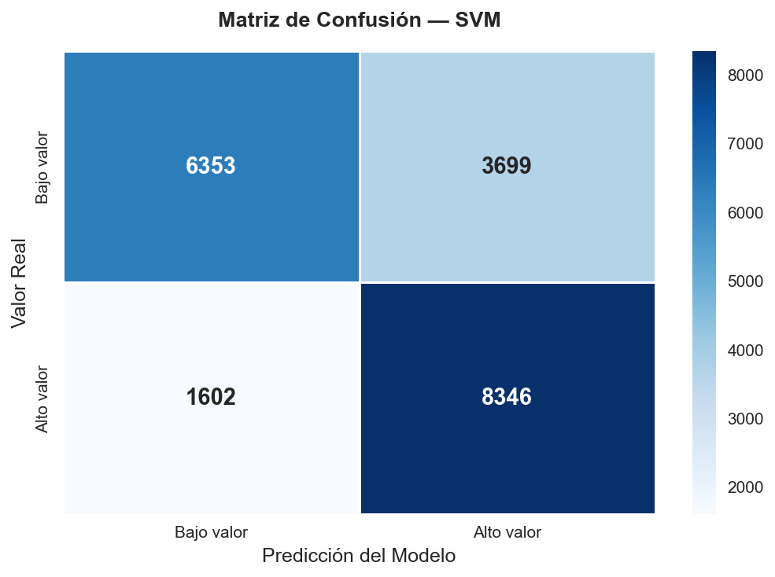</td>
</tr>
<tr>
<td align="center"><sub>Curvas ROC — comparación de modelos</sub></td>
<td align="center"><sub>Matriz de confusión del ganador</sub></td>
</tr>
</table>

El modelo, el `StandardScaler` y la mediana umbral se persisten con `joblib` en `modelos/`.
Las versiones de `requirements.txt` están fijadas a las usadas en el entrenamiento para que
`joblib.load` no emita avisos de incompatibilidad.

## Análisis exploratorio

<table>
<tr>
<td width="50%">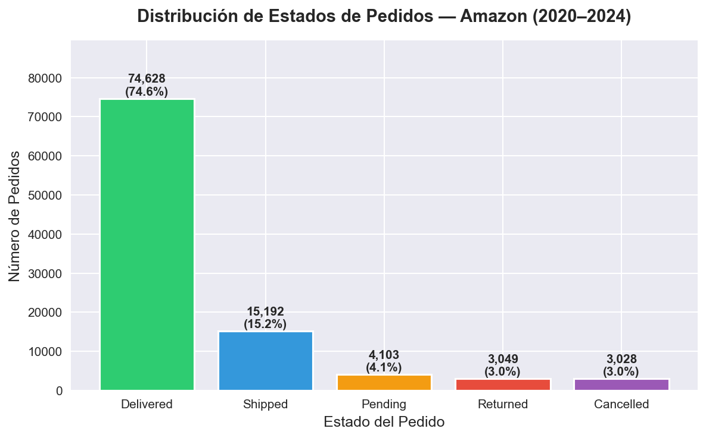</td>
<td width="50%">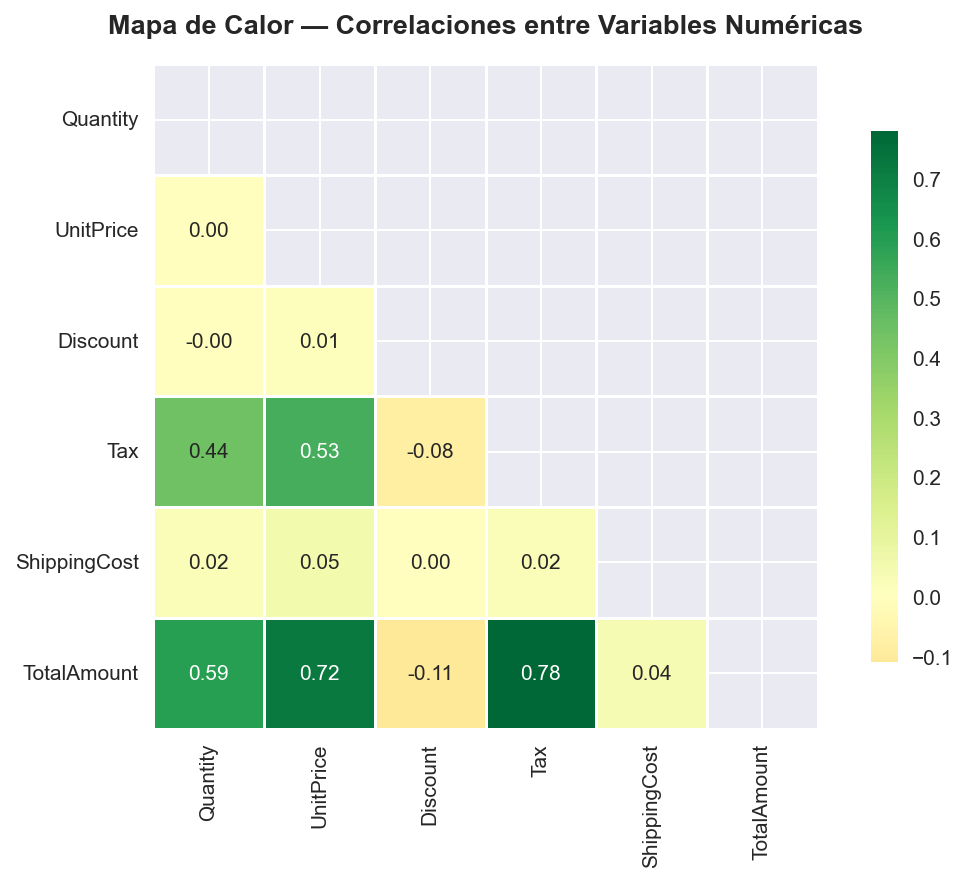</td>
</tr>
<tr>
<td align="center"><sub>Distribución de estados del pedido</sub></td>
<td align="center"><sub>Matriz de correlaciones</sub></td>
</tr>
</table>

Reducción de dimensionalidad para inspeccionar la separabilidad de las clases:

<table>
<tr>
<td width="50%">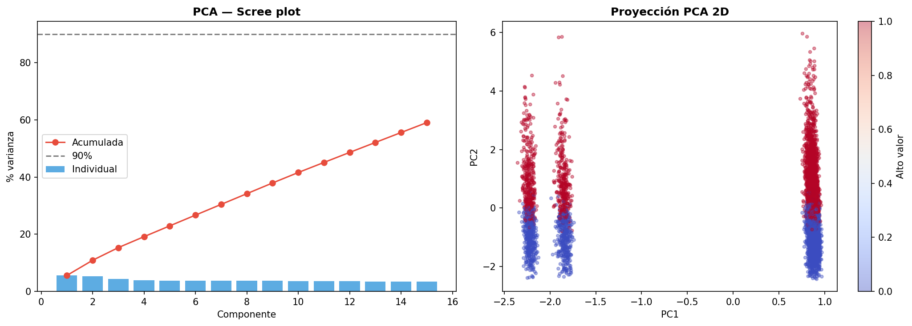</td>
<td width="50%">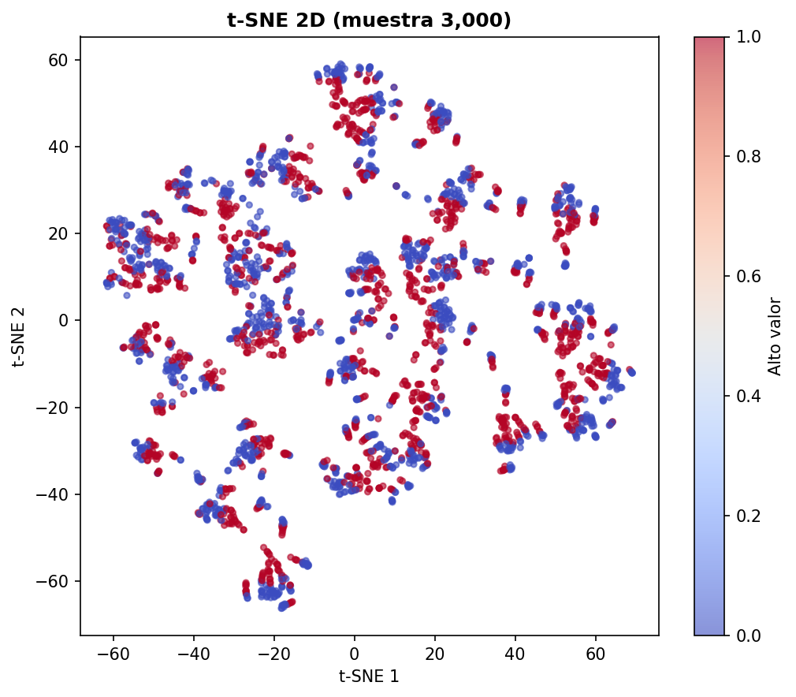</td>
</tr>
<tr>
<td align="center"><sub>PCA</sub></td>
<td align="center"><sub>t-SNE</sub></td>
</tr>
</table>

<details>
<summary>Más figuras — cancelaciones, distribuciones, outliers, regresión</summary>
<br/>

| | |
|---|---|
| 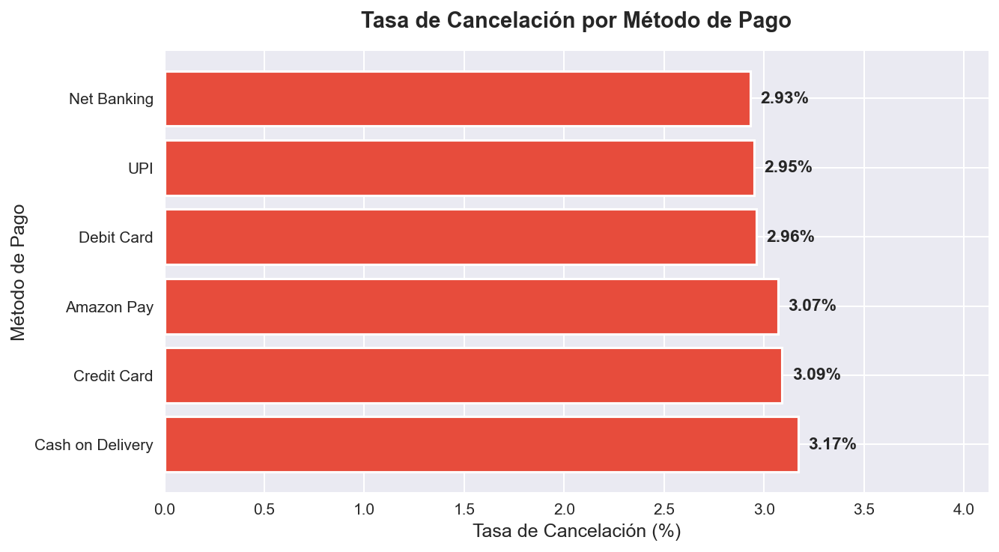 | 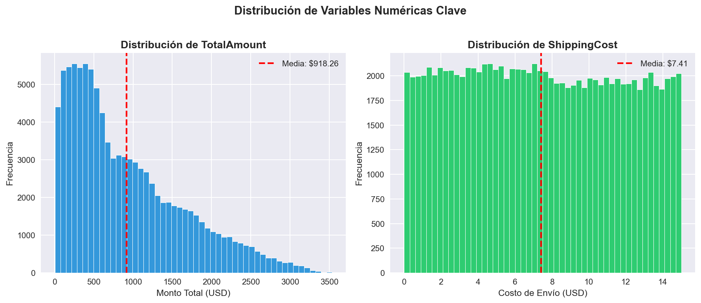 |
| Cancelaciones por método de pago | Distribuciones de variables |
| 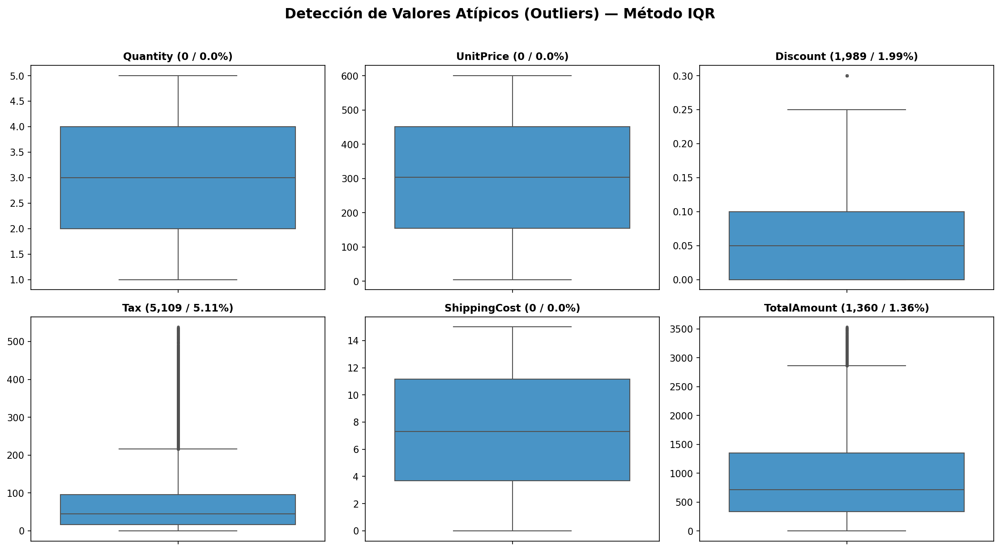 | 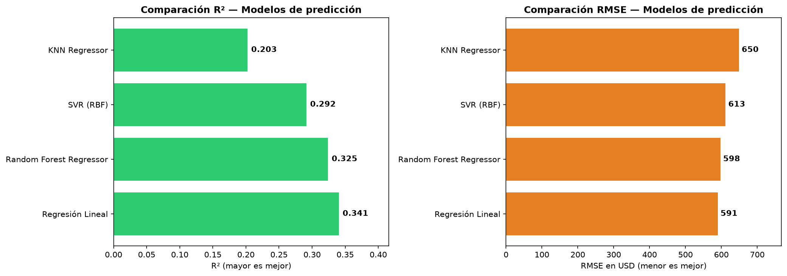 |
| Detección de outliers | Análisis de regresión |

</details>

## Ejecutar en local

```bash
pip install -r requirements.txt
streamlit run app.py
```

## Contenido

| Archivo | Descripción |
|---|---|
| `app.py` | App web de predicción: predicción, estadísticas del dataset e historial de sesión |
| `EDA.ipynb` | Análisis exploratorio de datos |
| `MODELOS.ipynb` | Entrenamiento y comparación de modelos; el ganador es un SVM |
| `Analisis_Avanzado.ipynb` | PCA, t-SNE, outliers y regresión |
| `modelos/` | Modelo entrenado, scaler y mediana umbral (`.pkl`) |
| `data/Amazon.csv` | Dataset (100 000 pedidos) |
| `graficas/` | Figuras generadas por el EDA y el modelado |

## Stack

`Python` · `scikit-learn` · `pandas` · `numpy` · `Streamlit` · `matplotlib` · `seaborn` · `joblib`
